<p align="center">
  
</p>


```
- Cursando FP Superior DAM
- Programación Multimedia y Dispositivos Móviles.
- Aprendiendo Android con Kotlin, paso a paso.
- Me gusta crear apps que resuelvan problemas reales.
```


<p>
  
  
  
  
  
</p>


| Proyecto | Qué es |
|---|---|
| [TwoDo](https://github.com/MauroGins/proyecto_anual_pmdm) | App Android para organizar listas, horarios y fechas en familia. Proyecto del curso. |


<p>
  
</p>


```
correo: ginskdev@gmail.com
```
